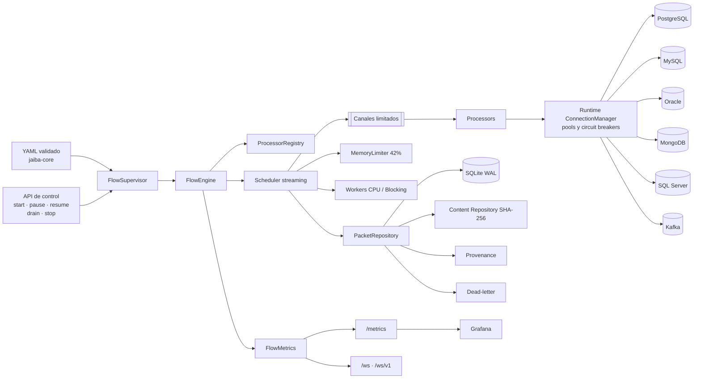

# Arquitectura interna del runtime Jaiba

## Propósito

Este documento describe el runtime. La arquitectura completa de la plataforma
se encuentra en [`project-vision.md`](project-vision.md).

Jaiba es un motor independiente de integración y movimiento de datos escrito en
Rust. Otros sistemas pueden utilizarlo mediante flujos y plugins; el núcleo no
conoce tablas ni reglas de negocio ajenas.

## Componentes

## Flujo de un paquete

1. Un procesador produce un `DataPacket`.
2. `OutputSender` estima su tamaño y reserva memoria.
3. Si el repositorio está activo, el contenido se persiste antes de encaminarlo.
4. El paquete entra en estado `PENDING`.
5. El scheduler lo reclama y cambia a `RUNNING`.
6. El procesador de destino ejecuta su trabajo.
7. En éxito queda `COMPLETED`.
8. Al agotar reintentos queda `DEAD_LETTER` y puede seguir una ruta `failure`.

## Garantía

La garantía actual es `at-least-once`. Jaiva evita perder trabajo persistido,
pero un paquete puede repetirse después de una caída. Los destinos deben usar
`upsert`, restricciones únicas o claves idempotentes.

## Streaming y backpressure

Los procesadores no devuelven todos sus resultados al finalizar. Emiten cada
paquete mediante `OutputSender` mientras continúan trabajando.

Los productores esperan cuando:

- el canal alcanza su capacidad;
- una conexión alcanza su límite de paquetes;
- se consume el presupuesto de memoria.

## Paralelismo

El scheduler aplica un límite global estricto y otro por procesador. Los
futuros de red permanecen en el runtime asíncrono, mientras que el trabajo CPU
y el I/O bloqueante usan cupos separados. Los procesadores pueden ejecutarse
sin orden, en orden completo o con afinidad por una clave de partición.

## Memoria

Jaiva detecta el menor valor entre la RAM física y el límite cgroup. De forma
predeterminada reserva el 42% para paquetes. Las reservas se liberan
automáticamente cuando el paquete deja de estar en cola o en procesamiento.

El ciclo de vida de **estado de dominio** es una capa paralela: Hot es RAM
local, Warm es distribución opcional, Cold es caché SSD y Frozen es archivo de
auditoría. No forman una escalera de durabilidad obligatoria. El diseño se
documenta en
[`priority-jme-memory-manager.md`](priority-jme-memory-manager.md); no sustituye
este limiter ni el `PacketRepository`.

## Persistencia

La implementación local utiliza:

- SQLite WAL para estados y provenance;
- archivos para contenido;
- SHA-256 para direccionamiento y verificación;
- escritura temporal, `fsync` y renombrado atómico.

Los contratos permiten añadir posteriormente PostgreSQL, S3 o MinIO sin cambiar
el scheduler.

## Extensibilidad

`ProcessorRegistry` permite registrar procesadores externos. Los conectores de
base se separarán por driver y declararán capacidades comunes. El diseño
multi-base de escritura está en
[`priority-4-database-writes.md`](priority-4-database-writes.md).
