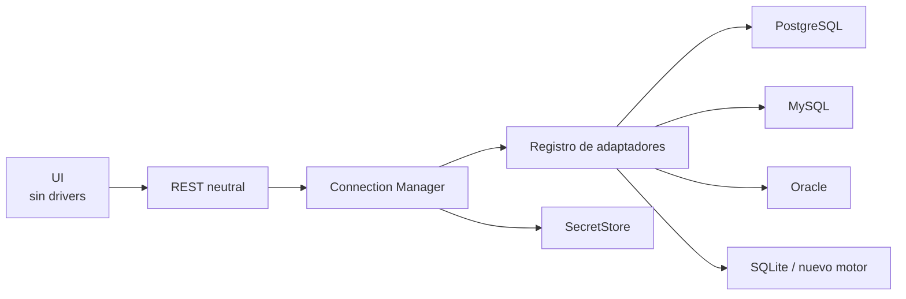

# Administrador de conexiones

Jaiba UI incluye un módulo independiente para crear y comprobar perfiles de
conexión reutilizables. Se abre desde **Conexiones** en la barra principal.

## Separación de responsabilidades

- La UI captura la configuración y consume la API administrativa.
- `jaiba-server` valida los datos y nunca devuelve la contraseña.
- `jaiba-connection-manager` conserva perfiles, estado y referencias a secretos.
- Los plugins de conexión realizan la prueba específica del motor.
- Los flujos deben referirse al alias (`connection: postgres_dma`), no a una URL.

El proveedor predeterminado actual es `InMemorySecretStore`, pensado para
desarrollo local. Los perfiles y secretos desaparecen al reiniciar el motor. En
producción debe reemplazarse por Vault, Kubernetes Secrets o un almacén cifrado
con una clave externa; no se debe persistir el mapa en memoria como JSON.

## Adaptadores extensibles

El núcleo no contiene una lista cerrada de motores. `ConnectionType` se
serializa como un identificador de texto y conserva valores desconocidos como
`sqlite`. Cada implementación de `ConnectionPlugin` publica nombre, versión,
categoría, puerto predeterminado y capacidades.

`ConnectionManager::register_plugin` es el único punto de registro. El catálogo
REST se genera desde los adaptadores instalados y la UI renderiza sus
capacidades. Para agregar un motor solo se implementa y registra un adaptador;
no se modifica el Connection Manager, sus handlers ni la interfaz.



## API

- `GET /api/v1/connection-types`
- `GET /api/v1/connections`
- `POST /api/v1/connections`
- `GET|PUT|DELETE /api/v1/connections/{id}`
- `POST /api/v1/connections/{id}/duplicate`
- `POST /api/v1/connections/{id}/test`
- `GET /api/v1/connections/{id}/diagnostics`
- `GET /api/v1/connections/{id}/metadata`
- `GET /api/v1/connections/{id}/metadata/{schema}/{name}`
- `POST /api/v1/connections/{id}/query/compile`

Estas rutas usan la misma autenticación administrativa que los flujos. Una
prueba correcta informa disponibilidad, latencia, versión, uso del pool y fecha.
Una prueba fallida conserva la fecha y el diagnóstico sin incluir el secreto.

## Explorador y constructor SQL

PostgreSQL y MySQL permiten explorar tablas, vistas, rutinas, columnas, llaves
e índices. El constructor envía una especificación neutral `QuerySpec`; el
servidor genera SQL seguro para el dialecto y devuelve la sentencia junto con
sus parámetros separados.

Cuando existe un procesador ejecutable, el adaptador devuelve
`processor_type` y `execution_statement`. La UI los trata como datos opacos y
no decide según el motor. Si el adaptador solo compila, la interfaz permite
copiar el SQL sin ofrecer un nodo.

El recorrido técnico completo está descrito en
[la bitácora de implementación](implementation-notes.md).

```mermaid
sequenceDiagram
    actor U as Usuario
    participant UI as jaiba-ui
    participant API as jaiba-server
    participant CM as Connection Manager
    participant DB as PostgreSQL / MySQL
    participant SQL as SQL Builder
    participant FB as Flow Builder

    U->>UI: Abre una conexión
    UI->>API: GET metadata
    API->>CM: Resuelve perfil y secreto
    CM->>DB: Consulta information_schema
    DB-->>CM: Tablas, columnas, llaves e índices
    CM-->>UI: Metadatos sin credenciales
    U->>UI: Selecciona columnas y filtros
    UI->>API: POST QuerySpec
    API->>SQL: Compilar según dialecto
    SQL-->>UI: SQL + parámetros separados

    alt adaptador publica procesador
        U->>UI: Enviar al diseñador
        UI->>FB: Guarda traspaso temporal
        FB->>FB: Crea el tipo indicado por la API
    else adaptador solo compila
        UI-->>U: Permite copiar SQL; nodo aún no disponible
    end
```

## Seguridad

- Las respuestas nunca contienen `password` ni `secret_ref`.
- La contraseña queda vacía al editar; dejarla vacía conserva la anterior.
- El frontend no usa `localStorage` ni `sessionStorage` para credenciales.
- Los logs no imprimen `ConnectionSecret`; su implementación de `Debug` redacta
  usuario y contraseña.
- Sin autenticación, el plano administrativo solo puede exponerse en loopback.
