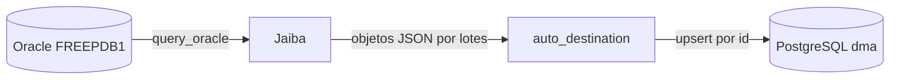

# Prueba Oracle → PostgreSQL

Esta prueba valida una carga real entre los contenedores locales de Oracle Free
y PostgreSQL usando Jaiba. Es repetible: cada ejecución actualiza las mismas dos
filas mediante `upsert` y no elimina volúmenes ni tablas existentes.



## Requisitos

- WSL con Rust y Cargo.
- Contenedor `oracle19` accesible en `127.0.0.1:1521`.
- Contenedor `dma_postgres` accesible en `127.0.0.1:5432`.
- Oracle Instant Client de 64 bits registrado en el cargador de WSL.
- `sqlplus` y `psql` disponibles dentro de sus respectivos contenedores.

Comprueba los motores:

```bash
docker ps --filter name=oracle19 --filter name=dma_postgres
```

## Ejecución

Desde WSL:

```bash
cd /mnt/d/dma/jaiva
bash scripts/test-oracle-to-postgres.sh
```

El script:

1. Genera una contraseña aleatoria que solo vive durante la ejecución.
2. Crea o actualiza `JAIVA_FLOW_TEST` dentro de `FREEPDB1` y le concede
   únicamente `CREATE SESSION`.
3. Crea o actualiza `jaiva_flow_test` en PostgreSQL.
4. Crea, si no existe, `public.jaiva_oracle_load_test`.
5. Concede al usuario técnico acceso solamente a esa tabla.
6. Exporta `ORACLE_DATABASE_URL` y `DATABASE_URL` sin guardar secretos en YAML.
7. Ejecuta [el flujo de ejemplo](../examples/oracle-to-postgres.yaml).
8. Consulta PostgreSQL para verificar los IDs `1001` y `1002`.

Un resultado correcto termina así:

```text
 id   | name                  | loaded_at
------+-----------------------+--------------------------------
 1001 | Fila 1 desde Oracle   | 2026-07-29T22:29:56.360+00:00
 1002 | Fila 2 desde Oracle   | 2026-07-29T22:29:56.360+00:00
```

El aviso `relation "jaiva_oracle_load_test" already exists, skipping` es normal:
confirma que PostgreSQL conservó la tabla de una ejecución anterior.

## Funcionamiento

`query_oracle` acepta consultas cuyo primer término sea `SELECT` o `WITH`.
Convierte cada fila en un objeto JSON, normaliza los nombres de columnas sin
comillas a minúsculas y emite paquetes según `batch_size`.

La consulta de prueba usa `DUAL`, por lo que no crea objetos en Oracle. Produce
registros con esta forma:

```json
{
  "id": 1001,
  "name": "Fila 1 desde Oracle",
  "loaded_at": "2026-07-29T22:29:56.360+00:00"
}
```

`auto_destination` detecta PostgreSQL como destino. Debido a
`conflict_columns: [id]`, selecciona `upsert`: una segunda ejecución actualiza
las filas en lugar de duplicarlas.

## Adaptación a una tabla real

Cambia la consulta y el mapeo en el YAML:

```yaml
- id: read_oracle
  type: query_oracle
  config:
    connection: source
    query: >-
      SELECT CUSTOMER_ID, CUSTOMER_NAME, UPDATED_AT
      FROM APP.CUSTOMERS
      WHERE UPDATED_AT >= TIMESTAMP '2026-01-01 00:00:00'
    batch_size: 1000

- id: load_postgres
  type: auto_destination
  config:
    connection: destination
    table: public.customers
    mode: auto
    columns:
      customer_id: customer_id
      customer_name: customer_name
      updated_at: updated_at
    conflict_columns:
      - customer_id
```

Antes de una carga real, crea la tabla de destino, concede permisos mínimos y
prueba primero con un filtro pequeño.

## Diagnóstico

### `DPI-1047`

Jaiba no encuentra `libclntsh.so`. Verifica:

```bash
/sbin/ldconfig -p | grep libclntsh
ldd /opt/oracle/instantclient_23_26/libclntsh.so.23.1 | grep "not found"
```

Jaiba debe iniciarse dentro del mismo WSL donde está registrado Instant Client.

### `ORA-01005`, `ORA-01017` o `ORA-28009`

- `ORA-01005`: contraseña vacía.
- `ORA-01017`: usuario o contraseña incorrectos.
- `ORA-28009`: se intentó usar `SYS` sin modo `SYSDBA`.

La prueba evita estos casos usando `JAIVA_FLOW_TEST`; el flujo no utiliza `SYS`.

### PostgreSQL rechaza la contraseña

Modificar `POSTGRES_PASSWORD` después de crear el volumen no cambia la
contraseña almacenada en PostgreSQL. No borres el volumen: restaura la
contraseña anterior o rota el rol explícitamente.

## Seguridad

- No guardes URLs con contraseñas dentro del YAML o Git.
- Usa perfiles del Connection Manager o variables de entorno.
- Emplea usuarios separados para extracción y carga.
- Concede solo `SELECT` en Oracle y los permisos necesarios sobre las tablas de
  destino en PostgreSQL.
- En producción usa un Secret Manager, Vault o mecanismo equivalente.
