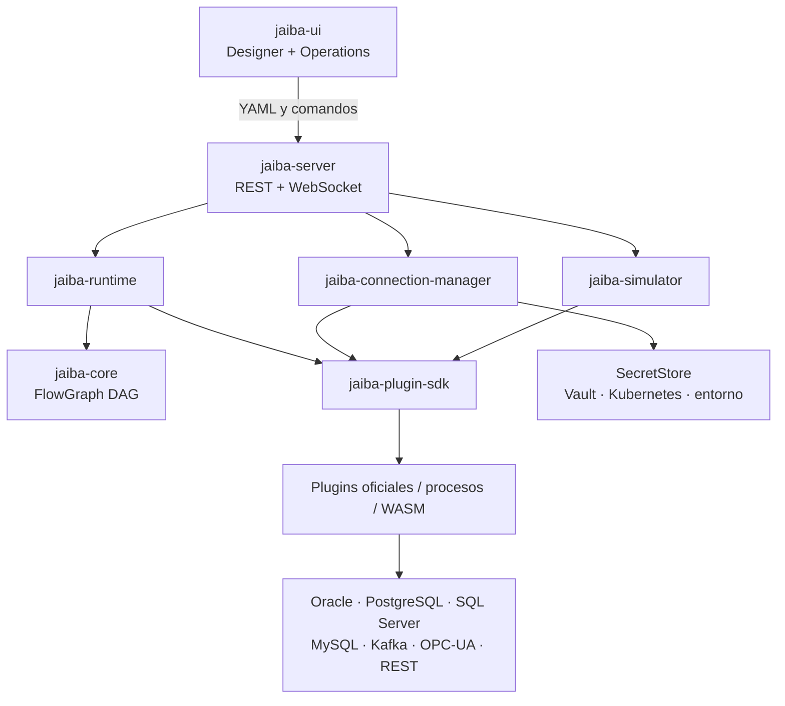
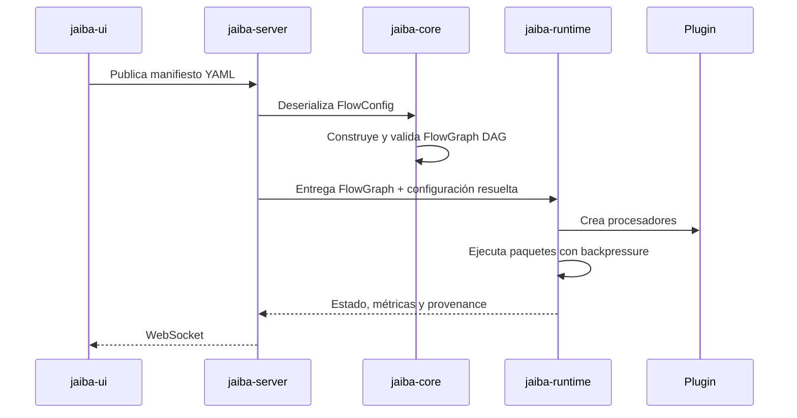

# Visión del proyecto Jaiba

## Propósito

Jaiba es una plataforma open source escrita en Rust para diseñar, ejecutar,
monitorear y simular flujos de procesamiento de datos. No intenta copiar Apache
NiFi: prioriza integración industrial, bases de datos, mensajería, APIs y nodos
de IA mediante módulos pequeños y contratos estables.

## Principios no negociables

1. Todo flujo es un grafo dirigido acíclico (DAG).
2. YAML es un formato de intercambio; nunca es una unidad ejecutable.
3. `jaiba-core` convierte la configuración deserializada en un `FlowGraph`
   validado.
4. Solo `jaiba-runtime` ejecuta el grafo.
5. La UI no carga drivers, no abre pools y no maneja contraseñas.
6. Las credenciales no forman parte del YAML ni de una exportación de perfil.
7. Un plugin depende del SDK, nunca de la UI.
8. Real, Mock y Replay usan el mismo grafo.

## Estructura

```text
Jaiba
├── crates
│   ├── jaiba-core
│   ├── jaiba-runtime
│   ├── jaiba-cli
│   ├── jaiba-server
│   ├── jaiba-plugin-sdk
│   └── jaiba-connection-manager
├── apps
│   └── jaiba-ui
├── plugins
│   ├── oracle
│   ├── postgresql
│   ├── mysql
│   ├── sqlserver
│   ├── kafka
│   ├── opc-ua
│   └── rest
└── simulator
    └── jaiba-simulator
```

## Límites



## Camino de un flujo



## Interfaz

El Designer solamente:

- crea nodos;
- conecta nodos;
- configura propiedades;
- importa o exporta YAML.

Operations puede solicitar al servidor iniciar, pausar, drenar, simular o
reproducir. Solicitar una operación no implica implementarla en React.

## Connection Manager

Un perfil contiene:

- identificador y nombre reutilizable;
- tipo;
- host, puerto y base;
- SSL, pool y timeout;
- referencia de secreto;
- etiquetas y último estado.

`ConnectionSecret` no implementa `Serialize` y redirige su salida `Debug`. El
perfil exportado contiene `secret_ref`, nunca usuario o contraseña.

El contrato soporta:

- crear, editar, eliminar y duplicar;
- importar y exportar metadatos;
- prueba con latencia, versión y pool;
- eventos de estado en tiempo real;
- diagnóstico específico por plugin;
- exploración de objetos y descripción de columnas, llaves e índices;
- compilación segura de un `QuerySpec` neutral al dialecto.

## Consulta visual

```yaml
source:
  schema: public
  table: customers
columns: [id, name, active]
filters:
  - field: active
    operator: eq
    value: true
order_by:
  - field: id
    direction: asc
limit: 1000
```

El plugin valida identificadores, genera SQL del dialecto y devuelve parámetros
separados. La UI nunca concatena SQL.

## Flujo sin credenciales

```yaml
id: clientes_activos
processors:
  - id: consultar
    type: database.query
    config:
      connection: postgres_dma
      query:
        source:
          schema: public
          table: customers
        columns: [id, name]
        limit: 1000
```

## Simulación

- `real`: usa el plugin y conexión reales.
- `mock`: obtiene paquetes de un proveedor que respeta el schema.
- `replay`: recupera paquetes por referencias de provenance.

El modo es contexto de ejecución y no crea una variante incompatible del DAG.

## Plugins

Rust no ofrece una ABI dinámica estable. Jaiba admite:

1. plugins oficiales compilados como crates;
2. plugins externos aislados en procesos con protocolo versionado;
3. futura ejecución con WebAssembly Component Model.

No se cargarán bibliotecas Rust arbitrarias dentro del proceso principal.

## Compatibilidad

Durante la transición:

- `jaiba` es el comando nuevo;
- `jaiva-flow` continúa como alias;
- `JAIBA_SERVER_ADDR` será la variable preferida;
- `JAIVA_OBSERVABILITY_ADDR` continúa aceptándose;
- `apps/jaiba-ui` es la ubicación real;
- `visualisa_jaiva` continúa como enlace compatible;
- métricas, tablas SQLite y rutas `.jaiva` conservan sus nombres para no romper
  instalaciones existentes.
